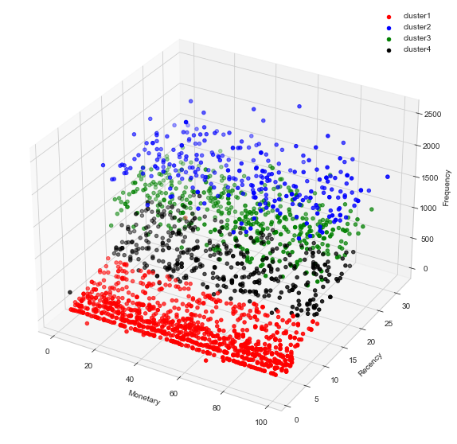
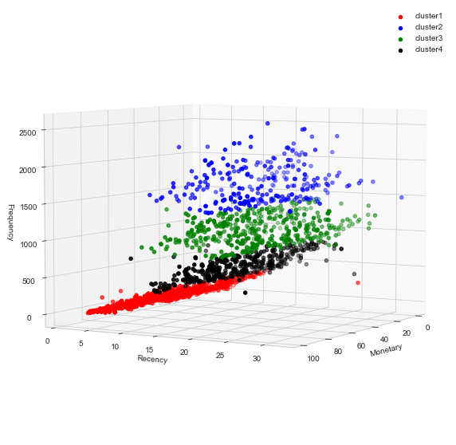

# Analysis of Impact of Marketing Campaigns on Customer Purchase Behaviour

This repo contains shareable parts of the project completed towards fulfilment of requirements for the *marketing Analytics* course, IIMB 2021

The objective of this project is to understand the impact that (in the considered dataset) marketing campaigns have on the purchase behaviour of customers. We will perform some basic EDA and identify patterns/trends in the data. 

Finally, a Recency-Frequency-Monetary value ([RFM](https://www.investopedia.com/terms/r/rfm-recency-frequency-monetary-value.asp)) model was created to cluster the customers in various buckets that could help in better targetting/understanding of customers.

Each cluster was then assigned a persona, details of which are available in the presentation [here](Final_Presentation.pptx)